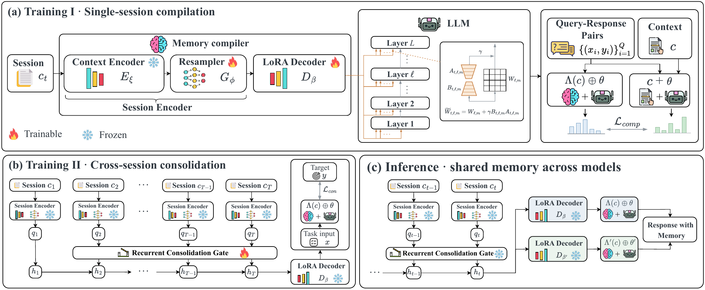

<h1 align="center">RPMem: Learning Long-Term Recurrent Parametric Memory Across Sessions for LLM Agents</h1>

<p align="center">
  Fanyu Zhao, Ruike Cao, Liang Dong, Fugen Yao, Jian Xu,<br>
  Guanjun Jiang, Han Zhang, Yifei Zhao, Yinsheng Li
</p>

<p align="center">
  <a href="https://arxiv.org/abs/2609.23466"></a>
  <a href="https://quark-medical.github.io/rpmem/"></a>
  <a href="https://huggingface.co/datasets/PolarSnowLeopard/RPMem-data"></a>
</p>

Official implementation of **RPMem**.

## Overview

RPMem learns recurrent parametric memory for LLM agents. A session compiler maps
each conversation into a latent representation, and a consolidation gate updates
a fixed-size memory across sessions. The memory is decoded into LoRA parameters
for a frozen reader, without replaying the conversation history at inference.

<p align="center">
  
</p>

## Installation

Python 3.10+ and CUDA-enabled PyTorch are required for training and evaluation.

```bash
git clone https://github.com/Quark-Medical/rpmem.git
cd rpmem
python -m venv .venv
source .venv/bin/activate
pip install -e '.[train,experiments]'
```

## Data

Download the processed compiler corpus and the three benchmarks (**4.3 GB**):

```bash
hf download PolarSnowLeopard/RPMem-data --repo-type dataset --local-dir data/rpmem
```

```text
data/rpmem/
├── compiler/                       # Sessions, probes, and splits
└── benchmarks/
    ├── perma/
    ├── personamem_v2/formal_v1/
    └── prefeval/formal_v1/
```

Teacher caches and trained weights are not included.

## Training and Evaluation

### Stage 1: Session Compiler

Generate Qwen3-8B teacher targets, then train the compiler on eight GPUs:

```bash
export CORPUS_ROOT="$PWD/data/rpmem/compiler"

python -m rpmem.training.precompute_teacher \
  --base_model_path Qwen/Qwen3-8B --train_data "$CORPUS_ROOT/train.corpus.json" \
  --output_dir outputs/teacher --top_k 32 --max_seq_len 640 \
  --max_teacher_ctx_tokens 4096 --max_teacher_seq_len 4864 --no-use_flash_attn

accelerate launch --config_file configs/accelerate_8gpu.yaml -m rpmem.training.train_hypernet \
  --config configs/compiler/qwen3_8b.yaml --train_data "$CORPUS_ROOT/train.corpus.json" \
  --teacher_logprobs_dir outputs/teacher --output_dir outputs/compiler \
  --no-use_flash_attn
```

### Stage 2: Memory Consolidation

Freeze the compiler and train a gate for each benchmark split. The commands
below use the paper experiments' initialization, `gate_zero_state`.

```bash
export CHECKPOINT="$PWD/outputs/compiler/pytorch_model.bin"
export BASE_MODEL_PATH=Qwen/Qwen3-8B
export CTX_ENCODER_PATH=answerdotai/ModernBERT-base
```

**PERMA.** Compile sessions, train the gate, and evaluate one held-out user:

```bash
PERMA_DATA_ROOT="$PWD/data/rpmem/benchmarks/perma" \
FIRST_SESSION_RULE=gate_zero_state VARIANT=clean_sd TEST_USER=334 \
  bash scripts/run_perma.sh
```

The full evaluation uses seven variants and ten leave-one-user-out folds.

**PersonaMem-v2 / PrefEval.** Set `BENCHMARK` to `personamem_v2` or `prefeval`:

```bash
BENCHMARK=personamem_v2
DATA="$PWD/data/rpmem/benchmarks/$BENCHMARK/formal_v1"
OUT="$PWD/outputs/$BENCHMARK/rpmem"

python "experiments/$BENCHMARK/precompute_phase2_latents.py" \
  --checkpoint "$CHECKPOINT" --data-root "$DATA" --output-dir "$OUT/latents" \
  --base-model-path "$BASE_MODEL_PATH" --ctx-encoder-path "$CTX_ENCODER_PATH" \
  --no-use-flash-attn

python "experiments/$BENCHMARK/train_cmp_gate.py" \
  --checkpoint "$CHECKPOINT" --data-root "$DATA" --latent-root "$OUT/latents" \
  --base-model-path "$BASE_MODEL_PATH" --ctx-encoder-path "$CTX_ENCODER_PATH" \
  --output-dir "$OUT/gate" --first-session-rule gate_zero_state --no-use-flash-attn

LATENT_FLAG=--canonical-latent-root
if [ "$BENCHMARK" = prefeval ]; then LATENT_FLAG=--session-latent-root; fi
python "experiments/$BENCHMARK/run_eval.py" \
  --method rpmem --checkpoint "$CHECKPOINT" --data-root "$DATA" \
  --base-model-path "$BASE_MODEL_PATH" --ctx-encoder-path "$CTX_ENCODER_PATH" \
  "$LATENT_FLAG" "$OUT/latents" --gate "$OUT/gate/gate.pt" \
  --output "$OUT/results.jsonl" --no-use-flash-attn
```

## Citation

```bibtex
@article{zhao2026rpmem,
  title={RPMem: Learning Long-Term Recurrent Parametric Memory Across Sessions for LLM Agents},
  author={Zhao, Fanyu and Cao, Ruike and Dong, Liang and Yao, Fugen and Xu, Jian and
          Jiang, Guanjun and Zhang, Han and Zhao, Yifei and Li, Yinsheng},
  journal={arXiv preprint arXiv:2609.23466},
  year={2026},
  url={https://arxiv.org/abs/2609.23466}
}
```

## Acknowledgements

We thank the authors of [Doc-to-LoRA (D2L)](https://github.com/SakanaAI/Doc-to-LoRA),
Idefics2, PERMA, PersonaMem-v2, and PrefEval for their open-source work.

This work was supported by Qwen Business Unit through Alibaba Research Intern Program.

## License

[Apache-2.0](LICENSE). Third-party code retains its [original notices](THIRD_PARTY_NOTICES.md);
datasets and models retain their respective licenses.
